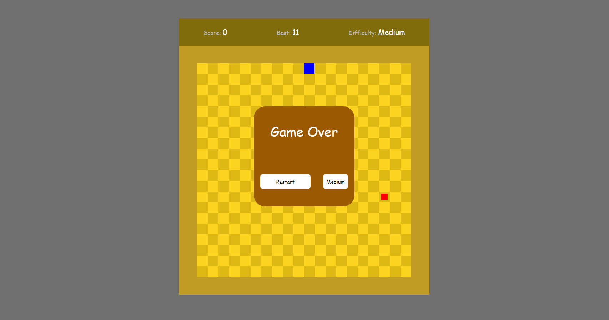

## Snake Game

Se você quiser ver o projeto funcionando [CLIQUE AQUI](https://caiofaraleski.github.io/SnakeGame/).

## Sobre o projeto

O Snake Game é um projeto criado para melhorar minhas habilidades em JavaScript, aprender a mexer um pouco mais com canvas e utilizar pela primeira vez o Webpack.

Agora ele faz parte do meu portifólio, fique à vontade para fornecer qualquer feedback que possa contribuir com o projeto, código, estrutura ou algo que possa me tornar um desenvolvedor melhor!😉

Conecte-se comigo no [LinkedIn](https://www.linkedin.com/in/caio-faraleski/).

## Funcionalidades

- Controles
    - Só são usadas as setas para as direções.

- Score
    - Mostra sua pontuação do jogo atual.

- Best
    - Mostra sua melhor pontuação ja feita.

- Difficulty
    - Mostra sua dificuldade atual.
    - Conforme a dificuldade muda, o numero de quadrados aumenta ou diminui.
    - Você pode mudar a dificuldade na tela de Start ou de Game Over

## Construído com 

- Html
- Css
- JavaScript
- Sass
- Bootstrap